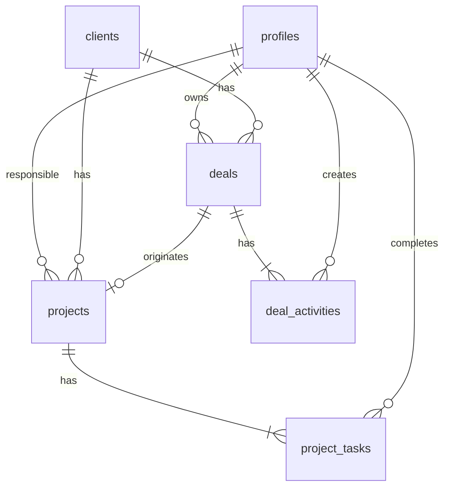

# AtlasOps — Constituição do Produto (gemini.md)
> Fonte única de verdade. Toda decisão de arquitetura, schema e regra de negócio está aqui.
> Atualizar apenas quando: um schema mudar, uma regra de negócio for adicionada, ou a arquitetura for modificada.

---

## 1. Identidade do Produto

**Nome:** AtlasOps  
**Tipo:** Torre de Controle operacional (uso interno Atlas)  
**Estrela Guia:** Centralizar toda a operação da Atlas (vendas, delivery, CS) em um sistema único com automações internas, eliminando planilhas e processos manuais para escalar sem aumentar headcount. A Atlas atende clientes com serviços de **Automações (RPA), SaaS, Websites, E-commerce e Tráfego Pago** — o AtlasOps gerencia todos esses tipos de projeto.  
**Público:** Detlef (Admin/Dev) + Sócia (Comercial/CS)  

---

## 2. Stack Técnica

| Camada | Tecnologia | Notas |
|--------|-----------|-------|
| Frontend | **Next.js 14+** (App Router, React, TypeScript) | Deploy via Coolify na VPS |
| Estilo | **Tailwind CSS** ou **CSS Modules** | A definir na Fase E |
| Banco de Dados | **Supabase** (PostgreSQL) | Projeto a criar |
| Auth | **Supabase Auth** | Email + senha (2 usuários iniciais) |
| Automações | **n8n** | Já rodando na infra |
| Integrações | WhatsApp API, GitHub API | Via n8n workflows |
| Deploy | **Coolify** (VPS existente) | CI/CD via push |

---

## 3. Personas e Permissões

| Persona | Papel | Acesso |
|---------|-------|--------|
| **Detlef** | Admin / Dev / Gestão | Acesso total. Todos os módulos. CRUD em tudo. Config do sistema (Roles: 'dev' ou 'gestao'). |
| **Sócia** | Comercial / CS | Módulos: Comercial (CRM, funil, propostas), Customer Success (health score, rituais). Delivery: somente leitura e conclusão de tarefas comerciais (Role: 'comercial'). |

---

## 4. Módulos do MVP

### MVP (Fase 1): Projetos + Comercial Básico

#### 4.1 Módulo Projetos (Gestão de Entregas)
- **Pipeline de projetos** com visão Kanban e Lista
- **Tipos de projeto:** Automação (RPA), SaaS, Website, E-commerce, Tráfego Pago
- **6 fases padrão:** Diagnóstico → Escopo → Desenho → Construção → Validação → Ativação
- **Quality Gates:**
  - ❌ Desenho assinado é bloqueador para início da Construção
  - ❌ Termo de Aceite assinado é bloqueador para Ativação
- **Card de projeto:** Nome do cliente, nome do projeto, tipo, fase atual, progresso (checklist), status (no prazo/atenção/atrasado), responsável, datas
- **Drawer de detalhes:** Checklist interativo por fase, entregáveis, notas, timeline
- **Playbook:** Referência do processo padrão por tipo de projeto

#### 4.2 Módulo Comercial (CRM Básico)
- **Funil de vendas:** 7 etapas (Lead → Contato → Reunião → Discovery → Proposta → Negociação → Contrato)
- **Cards de lead/oportunidade:** Nome da empresa, contato, valor estimado, fase, próxima ação
- **Cadência de prospecção:** Template de 8 toques em 21 dias
- **Roteiro de discovery:** Perguntas estruturadas embutidas no card
- **Objeções:** Banco de respostas para objeções comuns

### V1 (Fase 2 — após MVP validado):
- Customer Success (Health Score, rituais, upsell)
- Precificação (calculadora ROI)

### V2 (futuro):
- Marketing B2B, Planejamento 12 meses, Contratos/Jurídico

---

## 5. Modelo de Dados (Schema do Banco)

> ⚠️ **STATUS: DRAFT — Aguardando aprovação do usuário antes de criar migrations.**

### 5.1 Tabela: `profiles`
Extensão da tabela `auth.users` do Supabase.

| Campo | Tipo | Null | Default | Descrição |
|-------|------|------|---------|-----------|
| `id` | uuid | ❌ | FK → auth.users.id | PK, mesmo ID do auth |
| `full_name` | text | ❌ | — | Nome completo |
| `role` | text | ❌ | 'comercial' | 'gestao' \| 'dev' \| 'comercial' |
| `avatar_url` | text | ✅ | null | URL do avatar |
| `created_at` | timestamptz | ❌ | now() | — |

### 5.2 Tabela: `clients`
Empresas clientes da Atlas.

| Campo | Tipo | Null | Default | Descrição |
|-------|------|------|---------|-----------|
| `id` | uuid | ❌ | gen_random_uuid() | PK |
| `name` | text | ❌ | — | Nome da empresa |
| `contact_name` | text | ✅ | — | Nome do contato principal |
| `contact_email` | text | ✅ | — | Email do contato |
| `contact_phone` | text | ✅ | — | Telefone/WhatsApp |
| `segment` | text | ✅ | — | Segmento de mercado |
| `size` | text | ✅ | — | Porte (PME, Médio, Grande) |
| `notes` | text | ✅ | — | Observações gerais |
| `created_at` | timestamptz | ❌ | now() | — |
| `updated_at` | timestamptz | ❌ | now() | — |

### 5.3 Tabela: `deals` (Oportunidades/Leads do CRM)
Pipeline comercial.

| Campo | Tipo | Null | Default | Descrição |
|-------|------|------|---------|-----------|
| `id` | uuid | ❌ | gen_random_uuid() | PK |
| `client_id` | uuid | ✅ | null | FK → clients.id (null se lead novo sem empresa) |
| `title` | text | ❌ | — | Título da oportunidade |
| `stage` | text | ❌ | 'lead' | 'lead' \| 'contacted' \| 'meeting' \| 'discovery' \| 'proposal' \| 'negotiation' \| 'won' \| 'lost' |
| `estimated_value` | numeric | ✅ | null | Valor estimado (R$) |
| `estimated_mrr` | numeric | ✅ | null | MRR estimado (R$) |
| `owner_id` | uuid | ❌ | FK → profiles.id | Responsável |
| `next_action` | text | ✅ | — | Próxima ação a ser tomada |
| `next_action_date` | date | ✅ | null | Data da próxima ação |
| `lost_reason` | text | ✅ | — | Motivo da perda (se stage='lost') |
| `notes` | text | ✅ | — | Anotações |
| `created_at` | timestamptz | ❌ | now() | — |
| `updated_at` | timestamptz | ❌ | now() | — |

### 5.4 Tabela: `projects` (Projetos de Delivery)
Um projeto de automação RPA.

| Campo | Tipo | Null | Default | Descrição |
|-------|------|------|---------|-----------|
| `id` | uuid | ❌ | gen_random_uuid() | PK |
| `client_id` | uuid | ❌ | FK → clients.id | Cliente |
| `deal_id` | uuid | ✅ | null | FK → deals.id (deal que originou) |
| `name` | text | ❌ | — | Nome do projeto |
| `type` | text | ❌ | 'automation' | 'automation' \| 'saas' \| 'website' \| 'ecommerce' \| 'traffic' |
| `current_phase` | int2 | ❌ | 0 | 0=Diagnóstico, 1=Escopo, 2=Desenho, 3=Construção, 4=Validação, 5=Ativação |
| `status` | text | ❌ | 'on-track' | 'on-track' \| 'attention' \| 'delayed' \| 'completed' \| 'paused' |
| `responsible_id` | uuid | ❌ | FK → profiles.id | Responsável |
| `start_date` | date | ✅ | null | Data de início |
| `estimated_end_date` | date | ✅ | null | Previsão de entrega |
| `actual_end_date` | date | ✅ | null | Data real de entrega |
| `pdd_approved` | boolean | ❌ | false | Quality Gate: Desenho aprovado? |
| `uat_approved` | boolean | ❌ | false | Quality Gate: Validação aprovada? |
| `notes` | text | ✅ | — | Anotações do projeto |
| `created_at` | timestamptz | ❌ | now() | — |
| `updated_at` | timestamptz | ❌ | now() | — |

### 5.5 Tabela: `project_tasks` (Tarefas por fase)
Checklists de cada fase de cada projeto.

| Campo | Tipo | Null | Default | Descrição |
|-------|------|------|---------|-----------|
| `id` | uuid | ❌ | gen_random_uuid() | PK |
| `project_id` | uuid | ❌ | FK → projects.id (CASCADE) | Projeto |
| `phase` | int2 | ❌ | — | 0-5 (etapa do projeto) |
| `task_index` | int2 | ❌ | — | Ordem da tarefa na fase |
| `description` | text | ❌ | — | Texto da tarefa |
| `is_done` | boolean | ❌ | false | Concluída? |
| `completed_at` | timestamptz | ✅ | null | Quando foi marcada como feita |
| `completed_by` | uuid | ✅ | FK → profiles.id | Quem marcou |
| `assigned_to` | uuid | ✅ | null | FK → profiles.id (Atribuição individual) |
| `due_date` | date | ✅ | null | Data limite de conclusão |
| `field_type` | text | ❌ | 'checkbox' | 'checkbox' \| 'text' \| 'file' \| 'link' |
| `field_value` | text | ✅ | null | Valor inserido para campos especiais |
| `assigned_role` | text | ✅ | null | Papel responsável ('dev' \| 'comercial' \| 'gestao') |

**Unique constraint:** (`project_id`, `phase`, `task_index`)

### 5.6 Tabela: `deal_activities` (Histórico de atividades do CRM)

| Campo | Tipo | Null | Default | Descrição |
|-------|------|------|---------|-----------|
| `id` | uuid | ❌ | gen_random_uuid() | PK |
| `deal_id` | uuid | ❌ | FK → deals.id (CASCADE) | Oportunidade |
| `type` | text | ❌ | — | 'note' \| 'call' \| 'email' \| 'meeting' \| 'stage_change' |
| `content` | text | ❌ | — | Descrição da atividade |
| `created_by` | uuid | ❌ | FK → profiles.id | Autor |
| `created_at` | timestamptz | ❌ | now() | — |

---

## 6. Relações entre Tabelas

---

## 7. Políticas RLS (Row Level Security)

> Como é uso interno (2 usuários apenas), RLS é simplificada:

| Tabela | Policy | Regra |
|--------|--------|-------|
| `profiles` | SELECT | Todos autenticados podem ver todos os perfis |
| `profiles` | UPDATE | Apenas o próprio perfil (`auth.uid() = id`) |
| `clients` | ALL | Todos autenticados |
| `deals` | SELECT | Todos autenticados |
| `deals` | INSERT/UPDATE/DELETE | `owner_id = auth.uid()` OU `role IN ('admin', 'dev', 'gestao')` |
| `projects` | ALL | Todos autenticados (admin, dev, gestao e comercial veem; admin, dev, gestao editam) |
| `project_tasks` | SELECT | Todos autenticados |
| `project_tasks` | UPDATE | `role IN ('admin', 'dev', 'gestao', 'comercial')` (comercial pode marcar suas próprias tarefas) |
| `deal_activities` | ALL | Todos autenticados |

---

## 8. Regras de Negócio Críticas

1. **Quality Gate — Desenho:** Um projeto NÃO pode avançar para `current_phase = 3` (Construção) se `pdd_approved = false`.
2. **Quality Gate — Validação:** Um projeto NÃO pode avançar para `current_phase = 5` (Ativação) se `uat_approved = false`.
3. **Autonomia de Exclusão e Arquivamento:** A exclusão permanente de projetos (e suas tarefas associadas) é exclusiva de administradores (Detlef). Os demais usuários podem arquivar projetos mudando o status para 'paused' (Pausado) ou 'completed' (Concluído) no Drawer, removendo-os da esteira ativa de trabalho mas preservando os dados no banco.
4. **Deal perdido requer motivo.** Se `stage = 'lost'`, `lost_reason` é obrigatório.
5. **Histórico imutável.** Registros em `deal_activities` nunca são editados ou deletados.
6. **Cascata Client → Projeto:** Um cliente só pode ser arquivado se todos seus projetos estiverem 'completed' ou 'paused'.

---

## 9. Invariantes Arquiteturais

- **Framework:** Next.js 14+ com App Router e TypeScript.
- **Banco:** Supabase (PostgreSQL). Toda lógica de negócio sensível roda no backend/DB.
- **Auth:** Supabase Auth com email/senha. Sem social login no MVP.
- **Deploy:** Coolify na VPS da Atlas.
- **Automações:** n8n para workflows assíncronos (alertas, relatórios, integrações).
- **Convenções:**
  - Componentes em PascalCase: `ProjectCard.tsx`
  - Páginas em App Router: `app/delivery/page.tsx`
  - Server Components por padrão. Client Components apenas quando necessário (interatividade).
  - Todas as queries usam o Supabase client (`@supabase/ssr`).
